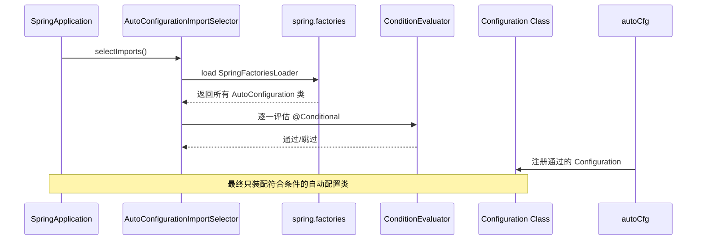
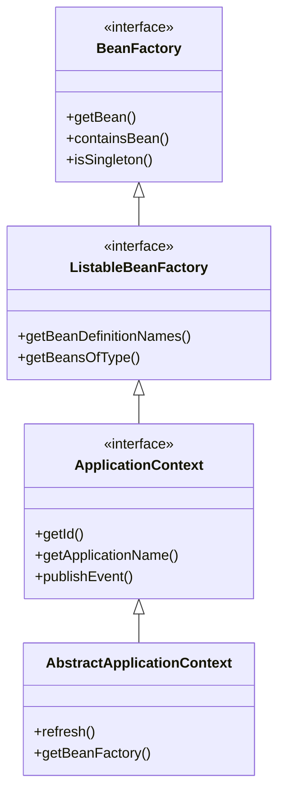

# PRD: Spring Boot 源码学习平台体验升级

| 文档版本 | 日期 | 作者 | 变更说明 |
|---------|------|------|---------|
| V1.0 | 2026-06-22 | Claude | 初始版本 |

---

## 目录

1. [背景与现状](#1-背景与现状)
2. [问题定义](#2-问题定义)
3. [用户画像](#3-用户画像)
4. [需求总览](#4-需求总览)
5. [功能详述](#5-功能详述)
   - [5.1 可视化图解系统](#51-可视化图解系统)
   - [5.2 交互式知识验证系统](#52-交互式知识验证系统)
   - [5.3 深度理解辅助系统](#53-深度理解辅助系统)
6. [技术方案](#6-技术方案)
7. [迭代路线图](#7-迭代路线图)
8. [验收标准](#8-验收标准)
9. [风险与对策](#9-风险与对策)

---

## 1. 背景与现状

### 1.1 项目现状

该仓库是基于《Spring Boot 源码解读与原理分析》一书构建的源码学习知识库，包含 14 个章节，覆盖 Spring Boot 自动装配、IOC 容器、AOP、嵌入式 Web 容器、JDBC/MyBatis/WebMVC/WebFlux 整合等核心主题。配套 Web 应用（learning-app/）提供 Markdown 渲染、章节导航、搜索、书签、进度追踪、主题切换等功能。

### 1.2 当前技术栈

| 层 | 技术 |
|--|------|
| 前端框架 | 原生 JavaScript（无框架依赖） |
| Markdown 渲染 | marked.js |
| 代码高亮 | highlight.js |
| 图表引擎 | mermaid.js（已加载但**零使用**） |
| 持久化 | localStorage |
| HTTP 服务 | Python http.server（开发环境） |

### 1.3 关键数据

- 章节数：14 章 + 前言/概要
- 内容总量：单文件超 1MB Markdown
- 现有图表数量：**0**
- 现有交互式练习数量：**0**

---

## 2. 问题定义

### 2.1 三大核心痛点

| # | 痛点 | 用户原话 | 根因分析 |
|---|------|---------|---------|
| P1 | 读完理解不了 | "读完理解不了" | 纯文本 + 代码的线性阅读体验，缺少视觉辅助和概念拆解。Spring 源码的调用链、继承关系、Bean 生命周期等抽象概念仅靠文字描述难以建立心智模型 |
| P2 | 图太少 | "图太少" | 零图表现状。Mermaid 引擎已集成但未嵌入任何一张流程图/时序图/类图。涉及大量容器继承体系、Bean 生命周期、AOP 代理链等需要图解的内容全部依靠文字 |
| P3 | 无法自我验证 | "没法验证自己看懂了" | 阅读后没有任何方式检验理解程度。无随堂问题、无代码练习、无交互式挑战。读者无法获得即时反馈，形成"看了就忘，忘了再看"的无效循环 |

### 2.2 衍生问题

- **留存率低**：缺乏参与感，连续阅读动机不足
- **知识碎片化**：各章节独立阅读，缺乏整体知识图谱串联
- **源码关联弱**：概念讲解与源码实现之间缺乏可视化映射
- **学习路径模糊**：读者不清楚各章节前置依赖，容易产生挫败感

---

## 3. 用户画像

### 3.1 目标用户群

| 画像 | 描述 | 使用场景 | 核心诉求 |
|------|------|---------|---------|
| **初级学习者** | 1-3 年 Java 经验，刚接触 Spring 源码，对 IOC/AOP 仅有概念了解 | 系统学习 Spring Boot 原理 | 可视化理解抽象概念，获得即时反馈保持动力 |
| **面试准备者** | 准备高阶 Java 岗位面试 | 针对性复习核心机制 | 重点知识提炼 + 自测功能检验掌握程度 |
| **教学者/博主** | 技术讲师，需要引用/演示 Spring 源码分析 | 备课、制作教学材料 | 高质量的图解导出、代码调用链可视化 |

### 3.2 用户旅程现状（As-Is）

```
进入首页 → 选择章节 → 阅读纯文本+代码 → 尝试理解
                                               ↓
                    ← 不理解？→ 重新阅读同一段（循环挫败）
                                               ↓
                    ← 觉得懂了？→ 没有验证手段 → 关闭页面
                                               ↓
                                   下次打开 → 已忘记 → 重新阅读
```

---

## 4. 需求总览

### 4.1 优先级定义

- **P0**：核心体验缺陷，必须解决
- **P1**：重要提升，建议在本迭代完成
- **P2**：加分项，可在后续迭代完成

### 4.2 需求全景图

```
┌─────────────────────────────────────────────────────────────┐
│                    Spring Boot 源码学习平台                    │
├──────────────────────┬──────────────────┬───────────────────┤
│  📊 可视化图解系统    │  ✏️ 知识验证系统   │  🧠 理解辅助系统   │
│  (P0)                │  (P0)            │  (P1)             │
│                      │                  │                   │
│  • 自动装配流程图     │  • 随堂选择题     │  • 源码路径追踪    │
│  • IOC 容器继承体系   │  • 拖拽排序题     │  • 概念知识图谱    │
│  • Bean 生命周期图    │  • 代码填空       │  • 学习路径推荐    │
│  • AOP 代理链图       │  • 简答/对比题    │  • 笔记高亮系统    │
│  • Web 容器架构图     │  • 章节测验      │  • AI 问答辅助     │
│  • 交互式调用链        │  • 进度成就系统   │                   │
└──────────────────────┴──────────────────┴───────────────────┘
```

### 4.3 需求矩阵

| ID | 需求 | 优先级 | 痛点映射 | 工作量估计 |
|----|------|--------|---------|-----------|
| F-01 | 章节内嵌 Mermaid 图解 | P0 | P1 (图太少) | 3 人周 |
| F-02 | 交互式类图/时序图 | P0 | P1 (图太少) | 2 人周 |
| F-03 | 随堂知识测验 | P0 | P3 (无法自验) | 3 人周 |
| F-04 | 代码填空练习 | P0 | P3 (无法自验) | 2 人周 |
| F-05 | 源码调用链可视化 | P1 | P1+P2 (理解不了+图少) | 3 人周 |
| F-06 | 概念知识图谱 | P1 | P2 (理解不了) | 2 人周 |
| F-07 | 学习路径推荐 | P1 | P2 (理解不了) | 1 人周 |
| F-08 | 笔记高亮与批注 | P1 | P2 (理解不了) | 1 人周 |
| F-09 | 进度成就系统 | P1 | P3 (无法自验) | 1 人周 |
| F-10 | AI 问答助手 | P2 | P2 (理解不了) | 3 人周 |

---

## 5. 功能详述

### 5.1 可视化图解系统（P0）

#### 5.1.1 章节内嵌 Mermaid 图解

**目标**：每个核心概念至少配一张示意图，消除"零图表"现状。

**需要嵌入图表的场景清单（首批）**：

| 章节 | 主题 | 图表类型 | 说明 |
|------|------|---------|------|
| Ch01 | Spring Boot 与 Spring Framework 关系 | 架构分层图 | 展示 Spring Boot 封装层次 |
| Ch02 | @Import 的四种导入方式 | 流程图 | 展示 ImportSelector/ImportBeanDefinitionRegistrar 等执行路径 |
| Ch02 | 自动装配执行流程 | 时序图 | Spring Boot 启动到 auto-configuration 的过程 |
| Ch03 | IOC 容器继承体系 | 类图 | BeanFactory → ApplicationContext 继承树 |
| Ch03 | Bean 的完整生命周期 | 流程图 | 从扫描 → 注册 → 实例化 → 初始化 → 销毁 |
| Ch04 | SpringApplication run() 流程 | 流程图 | 整个 run 方法的 10+ 步骤 |
| Ch05 | AOP 代理创建流程 | 流程图 | @EnableAspectJAutoProxy → 代理对象生成 |
| Ch06 | 准备容器与环境 | 时序图 | prepareContext / refresh 前的工作 |
| Ch07 | IOC 容器 refresh() | 流程图 | AbstractApplicationContext.refresh() 13 个步骤 |
| Ch08 | 嵌入式 Web 容器启动 | 时序图 | Tomcat 启动全流程 |
| Ch09 | AOP 通知执行顺序 | 时序图 | Around → Before → AfterReturning 调用链 |
| Ch10-13 | 整合 JDBC/MyBatis/MVC/Flux | 架构图 | 各场景自动配置类及其依赖关系 |

**技术要求**：

- 图表使用 Mermaid 语法嵌入 Markdown（渲染器已支持 ```` ```mermaid ````）
- 支持点击图表节点跳转到相关文字解释（锚点联动）
- 支持图表全屏查看
- 图表支持导出为 PNG/SVG

**Ch02 自动装配时序图示例**：



#### 5.1.2 交互式调用链视图

**目标**：源码阅读中最难的是跟踪调用链，交互式视图允许读者"一步一步跟着代码走"。

**实现方案**：

- 在关键流程（如 refresh()、run()、getBean()）处嵌入步进式调用链
- 每一帧展示：当前调用方法签名 + 关键源码片段 + 当前参数/状态
- 提供"上一步/下一步"手动步进按钮
- 提供"自动播放"模式，每步停留 2-3 秒

**UI 示意**：

```
┌──────────────────────────────────────────────────┐
│  🔄 SpringApplication.run() 调用链步进          │
│  ┌── 步骤 3/12 ───────────────────────────────┐ │
│  │                                             │ │
│  │  当前方法：prepareEnvironment()              │ │
│  │  源码:                                      │ │
│  │  ┌─────────────────────────────────────┐    │ │
│  │  │ ConfigurableEnvironment env =       │    │ │
│  │  │   getOrCreateEnvironment();         │    │ │
│  │  │ configureEnvironment(env, args);    │    │ │
│  │  └─────────────────────────────────────┘    │ │
│  │  说明: 准备并配置应用环境(Environment)      │ │
│  │                                             │ │
│  │  ◀ 上一步          下一步 ▶    ▶▶ 自动播放  │ │
│  └─────────────────────────────────────────────┘ │
└──────────────────────────────────────────────────┘
```

#### 5.1.3 类图/继承关系可视化

**目标**：Spring 源码中有大量类继承体系（如 ApplicationContext 的 10+ 层接口），文字描述极难理清。

**实现方案**：

- 使用 Mermaid classDiagram 自动生成类继承关系图
- 关键类图支持展开/折叠内部方法
- 点击类名跳转到对应章节或源码位置

**渲染后的类图示例**：



---

### 5.2 交互式知识验证系统（P0）

#### 5.2.1 随堂选择题

**目标**：每个小节末尾嵌入 1-3 道选择题，即时检验理解。

**交互逻辑**：

- 题目以内联卡片形式嵌入章节内容末尾
- 单选/多选两种模式
- 选择后立即显示正误与解析
- 解析应指出正确答案对应的原文位置（锚点跳转）
- 答对/答错计入统计数据

**数据模型**：

```typescript
interface QuizQuestion {
  id: string;
  chapterId: string;
  sectionAnchor: string;        // 对应章节内的锚点
  type: 'single' | 'multiple';
  difficulty: 'easy' | 'medium' | 'hard';
  question: string;
  options: { id: string; text: string }[];
  correctAnswer: string[];      // 选项 ID 数组
  explanation: string;          // 解析
  referenceAnchor: string;      // 原文锚点
}
```

**数据存储**：以独立 JSON 文件存储，不污染 Markdown 源文件。

```
learning-app/
  data/
    quizzes/
      ch01.json
      ch02.json
      ...
```

**UI 示意**：

```
┌────────────────────────────────────────────────────┐
│  ✏️ 随堂测验                                      │
│                                                    │
│  第 2 章 · 自动装配的条件匹配                       │
│                                                    │
│  Q: 以下哪个注解用于控制自动配置类的生效条件？      │
│                                                    │
│  ○ A. @Bean                                       │
│  ○ B. @ConditionalOnClass                         │
│  ○ C. @Autowired                                  │
│  ○ D. @Value                                      │
│                                                    │
│  [ 提交答案 ]                                      │
│                                                    │
│  ┌────────────────────────────────────────────┐    │
│  │ ✅ 正确！                                  │    │
│  │                                            │    │
│  │ @ConditionalOnClass 是 Spring Boot 的条件  │    │
│  │ 装配注解，当指定类在 classpath 中存在时     │    │
│  │ 才会加载对应的自动配置类。                  │    │
│  │ → 查看原文 §2.3.3                          │    │
│  └────────────────────────────────────────────┘    │
└────────────────────────────────────────────────────┘
```

#### 5.2.2 代码填空练习

**目标**：通过补全关键代码片段，验证对源码实现的理解。

**交互逻辑**：

- 显示一段源码，关键部分以 `___(n)___` 占位
- 用户从下拉列表选择或输入答案
- 可显示提示（显示首字母或类型信息）
- 提交后显示正确答案并解析

**示例**（Ch03 Bean 生命周期相关）：

```java
// 请补全 AbstractApplicationContext.refresh() 中的关键步骤
@Override
public void refresh() throws BeansException, IllegalStateException {
    // 步骤1: 准备刷新
    ___(1)___();
    // 步骤2: 获取 BeanFactory
    ConfigurableListableBeanFactory beanFactory = ___(2)___();
    // 步骤3: 准备 BeanFactory
    prepareBeanFactory(beanFactory);
    // ...
}
```

#### 5.2.3 章节测验与综合测评

**目标**：每个 Part 结束时提供综合测验，全书结束后提供最终测评。

**交互逻辑**：

- 10-15 道题/章节，涵盖选择题 + 排序题
- 限时模式与非限时模式
- 完成后显示得分、各知识点掌握度雷达图、薄弱环节推荐重新阅读
- 错题本功能（自动收集错题）

#### 5.2.4 进度与成就系统

**目标**：通过游戏化设计增强持续学习动机。

**成就设计（首批）**：

| 成就名称 | 触发条件 | 徽章 |
|---------|---------|------|
| 初窥门径 | 完成第 1 章阅读 | 🥉 |
| 装配大师 | 完成第 2 章所有测验（正确率 ≥80%） | 🔧 |
| 容器探索者 | 完成第 3 章 + 第 7 章 | 🏺 |
| 面向切面 | 完成第 5 章 + 第 9 章 | ⚔️ |
| 源码猎人 | 完成全部 14 章阅读 | 🏆 |
| 满分学霸 | 任意章节测验满分 | 💯 |
| 连续学习 | 连续 7 天登录学习 | 🔥 |

---

### 5.3 深度理解辅助系统（P1）

#### 5.3.1 源码路径追踪

**目标**：每个核心概念/配置类旁标注其对应源码的 GitHub 链接和本地路径，让读者"学完就能找到源码"。

**实现方案**：
- 在关键段落旁显示源码位置标签
- 自动链接到 Spring Boot GitHub 源码（基于版本号 tags）

**UI 示意**：

```
自动装配的核心是 AutoConfigurationImportSelector [📎 spring-boot-autoconfigure:2.7.x]
其 selectImports() 方法会从 spring.factories 中读取所有
AutoConfiguration 类 [📎 spring-boot-autoconfigure/META-INF/spring.factories]
```

#### 5.3.2 概念知识图谱

**目标**：将全书 14 章的核心概念组织为一张可交互的知识网络图，展示概念间的依赖关系。

**实现方案**：

- 使用 D3.js 或 vis-network 渲染力导向图
- 节点 = 概念（如 IOC 容器、自动装配、@Import、Conditional）
- 边 = 关系（依赖、扩展、实现、关联）
- 点击节点跳转到对应章节
- 高亮显示当前章节涉及的所有概念节点
- 支持筛选（只看某部分/某章节的关联概念）

**数据模型**：

```typescript
interface KnowledgeNode {
  id: string;
  label: string;
  chapterId: string;
  type: 'concept' | 'annotation' | 'class' | 'mechanism';
  description: string;
}

interface KnowledgeEdge {
  source: string;
  target: string;
  relation: 'depends_on' | 'implements' | 'extends' | 'triggers';
}
```

#### 5.3.3 学习路径推荐

**目标**：根据读者的目标和当前进度，推荐最优学习路径。

**实现方案**：

- 预定义多条学习路径（如"快速入门"、"全面精通"、"面试突击"）
- 每条路径标注预计耗时和前置条件
- 读者可切换路径，进度独立记录
- 首页显示当前路径的下一章推荐

| 路径 | 包含章节 | 预计耗时 | 适合人群 |
|------|---------|---------|---------|
| 📖 标准路线 | Ch01→Ch02→...→Ch14 | 14 天 | 系统学习者 |
| ⚡ 快速入门 | Ch01→Ch02→Ch03→Ch07→Ch14 | 5 天 | 时间有限但想理解核心 |
| 🎯 面试突击 | Ch02+Ch03+Ch04+Ch05+Ch07 | 5 天 | 面试准备者 |
| 🔌 整合路线 | Ch01→Ch10→Ch11→Ch12→Ch13 | 5 天 | 实际项目驱动 |

#### 5.3.4 笔记与高亮系统

**目标**：读者可以在阅读时选中文本做高亮标记或添加笔记。

**实现方案**：

- 选中文本后弹出浮动工具栏：「高亮」「添加笔记」
- 高亮数据存储在 localStorage（按章节 + 文本范围索引）
- 侧边栏提供"我的笔记"入口，按章节分组展示
- 高亮颜色支持分类（红色=疑问、黄色=重点、绿色=已掌握）

#### 5.3.5 AI 问答助手（P2，可后续迭代）

**目标**：基于全书内容，提供 RAG 问答能力，读者可以针对不懂的概念提问。

**实现方案**：

- 使用浏览器端轻量级 embedding 或后端 API
- 读者在侧边栏输入问题，系统返回书中相关段落
- 不做通用对话（保持轻量），仅做"语义搜索 + 定位章节"
- 可作为独立迭代，不阻塞 P0/P1 需求

---

## 6. 技术方案

### 6.1 架构概览

```
┌────────────────────────────────────────────────────────────┐
│                    learning-app/ (静态页面)                  │
├────────────────────────────────────────────────────────────┤
│  UI 层: index.html + css/ (主题、布局、组件)                │
├────────────────────────────────────────────────────────────┤
│  应用层: app.js (事件总线 + 模块编排)                       │
├──────────┬──────────┬──────────┬──────────┬────────────────┤
│ renderer │  router  │  quiz    │ progress │  knowledge-graph│
│ (渲染)   │  (路由)  │  (测验)  │ (成就)   │  (知识图谱)    │
├──────────┴──────────┴──────────┴──────────┴────────────────┤
│  数据层: storage.js (localStorage) + data/ (JSON 数据文件)  │
├────────────────────────────────────────────────────────────┤
│  外部依赖: marked.js + highlight.js + mermaid.js + D3.js   │
└────────────────────────────────────────────────────────────┘
```

### 6.2 新增模块职责

| 模块 | 职责 | 新增文件 |
|------|------|---------|
| **QuizEngine** | 渲染题目、判断答案、统计正确率 | `js/quiz.js` |
| **Achievement** | 成就条件检测、徽章展示 | `js/achievement.js` |
| **KnowledgeGraph** | 知识图谱数据加载+渲染 | `js/knowledge-graph.js` |
| **CallChain** | 步进式调用链展示 | `js/callchain.js` |
| **NoteHighlighter** | 文本选中、高亮、笔记管理 | `js/notes.js` |
| **LearningPath** | 学习路径定义与推荐引擎 | `js/learning-path.js` |

### 6.3 数据目录结构

```
learning-app/
  data/
    quizzes/
      ch01.json       # 第1章随堂测验
      ch02.json       # 第2章随堂测验
      ...
      part1.json      # 第1部分综合测试
      part2.json
      ...
      final.json      # 全书综合测试
    knowledge-graph/
      nodes.json      # 知识图谱节点
      edges.json      # 知识图谱边
    achievements.json # 成就定义
    learning-paths.json # 学习路径定义
```

### 6.4 Quiz JSON 格式规范

```json
{
  "chapterId": "02",
  "sections": [
    {
      "sectionAnchor": "23-模块装配",
      "questions": [
        {
          "id": "02-001",
          "type": "single",
          "difficulty": "easy",
          "question": "以下哪个注解是 Spring 模块装配的核心？",
          "options": [
            { "id": "A", "text": "@Component" },
            { "id": "B", "text": "@Import" },
            { "id": "C", "text": "@Service" },
            { "id": "D", "text": "@Bean" }
          ],
          "correctAnswer": ["B"],
          "explanation": "@Import 是模块装配的核心注解，可以将普通类、配置类、ImportSelector、ImportBeanDefinitionRegistrar 等导入 IOC 容器。",
          "referenceAnchor": "232-快速体会模块装配"
        }
      ]
    }
  ]
}
```

### 6.5 无框架决策说明

**为什么继续使用原生 JS？**

| 方案 | 优势 | 劣势 |
|------|------|------|
| 保持原生 JS | 无构建步骤、零依赖、与现有代码完全一致、降低贡献门槛 | 类型安全性弱、无组件化 |
| 迁移到 Vue/React | 组件化、生态丰富 | 需要构建工具链、现有代码需全部重写、增加 fork 成本 |
| 迁移到 Svelte | 轻量、无虚拟 DOM | 仍需要构建步骤 |

**决策**：保持原生 JS。原因：该项目的核心价值是内容，而非前端工程化。引入框架带来的构建复杂度与收益不成正比。

### 6.6 知识图谱数据规范

```json
// nodes.json
{
  "nodes": [
    { "id": "ioc-container", "label": "IOC 容器", "chapterId": "03", "type": "concept", "description": "Spring 框架核心容器，管理 Bean 生命周期" },
    { "id": "bean-lifecycle", "label": "Bean 生命周期", "chapterId": "03", "type": "mechanism", "description": "从扫描到销毁的完整过程" },
    { "id": "application-context", "label": "ApplicationContext", "chapterId": "03", "type": "class", "description": "IOC 容器的核心接口" },
    { "id": "component-scan", "label": "组件扫描", "chapterId": "02", "type": "mechanism", "description": "扫描指定包路径注册 Bean" }
  ],
  "edges": [
    { "source": "ioc-container", "target": "application-context", "relation": "implements" },
    { "source": "ioc-container", "target": "bean-lifecycle", "relation": "contains" },
    { "source": "component-scan", "target": "bean-lifecycle", "relation": "triggers" }
  ]
}
```

---

## 7. 迭代路线图

### Phase 1：基础体验升级（2 周）

| 任务 | 产出 | 工作量 |
|------|------|--------|
| 编写首批 Mermaid 图解（Ch01-Ch05） | 20+ 张图表嵌入 MD 文件 | 1 人周 |
| 编写随堂选择题题库（Ch01-Ch05） | 5 个 JSON 文件，50+ 题 | 1 人周 |
| QuizEngine 模块开发 | `js/quiz.js` + 测验 UI 组件 | 1 人周 |

**验收标准**：
- Ch01-Ch05 每个核心小节至少 1 张图表
- 图表在 Mermaid 渲染后清晰可读，无语法错误
- 每章至少 8 道随堂测验题，50% 题目涉及图表内容验证

### Phase 2：验证系统完善（2 周）

| 任务 | 产出 | 工作量 |
|------|------|--------|
| 代码填空功能 | `js/quiz.js` 支持 fill-blank 类型 | 2 人天 |
| 题库补全（Ch06-Ch14） | 9 个 JSON 文件，100+ 题 | 1 人周 |
| 章节测验 + 综合测验 | 4 个 Part 测验 + 1 个全书测验 | 3 人天 |
| 成就系统 | `js/achievement.js` + 徽章 UI | 2 人天 |
| 错题本功能 | 错题收集与回顾 UI | 2 人天 |

**验收标准**：
- 全部 14 章均配有随堂测验
- 代码填空覆盖 3 个以上核心章节
- 成就系统至少 7 个可解锁成就
- 错题自动收集，支持按章节筛选

### Phase 3：理解辅助系统（2 周）

| 任务 | 产出 | 工作量 |
|------|------|--------|
| 概念知识图谱 | D3.js 渲染 + 数据定义 + 交互 | 1 人周 |
| 源码路径追踪标签 | 关键源码位置标注 + GitHub 链接 | 2 人天 |
| 学习路径推荐 | `js/learning-path.js` + 首页展示 | 2 人天 |
| 步进式调用链 | `js/callchain.js`（第 4、7 章试点） | 3 人天 |
| 笔记高亮系统 | `js/notes.js` + 浮动工具栏 | 2 人天 |

**验收标准**：
- 知识图谱覆盖全书核心概念（≥40 节点）
- 点击节点可跳转到对应章节
- 学习路径 ≥4 条，切换后首页推荐更新
- 调用链步进在 Ch04、Ch07 可用

### Phase 4：打磨与发布（1 周）

| 任务 | 产出 | 工作量 |
|------|------|--------|
| UI/UX 打磨 | 测验动画、过渡效果、响应式适配 | 2 人天 |
| 性能优化 | 图表懒加载、Quiz 数据按需加载 | 1 人天 |
| 用户引导 | 首页新手引导、快捷键提示 | 1 人天 |
| 兼容性测试 | Chrome/Firefox/Edge/Safari 测试 | 1 人天 |

**验收标准**：
- Lighthouse 评分 ≥90
- 首次内容绘制 ≤1.5s
- 全浏览器兼容无功能性缺陷

---

## 8. 验收标准

### 8.1 功能验收清单

| # | 验收项 | 验收标准 | 阶段 |
|---|-------|---------|------|
| 1 | 图表渲染 | 所有 ```mermaid 块正确渲染为 SVG | P1 |
| 2 | 图表交互 | 点击图表可全屏查看，可导出 PNG | P1 |
| 3 | 随堂测验 | 每章末尾正确嵌入测验卡片 | P1-P2 |
| 4 | 即时反馈 | 选择后即时显示正确/错误与解析 | P2 |
| 5 | 代码填空 | 下拉选择/输入补全，提交后校验 | P2 |
| 6 | 成就解锁 | 达成条件后自动弹出成就通知 | P2 |
| 7 | 知识图谱 | 力导向图渲染，节点可交互 | P3 |
| 8 | 学习路径 | 切换后首页和路线图同步更新 | P3 |
| 9 | 调用链步进 | 上一步/下一步正常切换 | P3 |
| 10 | 笔记高亮 | 选中后工具栏弹出，高亮可持久化 | P3 |

### 8.2 用户体验验收

- **学习效率**：首次阅读 Ch02 自动装配后，能正确描述 @Import 的 4 种方式（通过测验正确率 ≥80% 验证）
- **满意度**：问卷调研 "图表是否有帮助" 好评率 ≥85%
- **留存率**：上线后 7 日回访率相比基线提升 ≥30%

---

## 9. 风险与对策

| # | 风险 | 概率 | 影响 | 对策 |
|---|------|------|------|------|
| R1 | Mermaid 渲染复杂图表时性能下降 | 中 | 中 | 图表懒加载，折叠非可视区域图表；大图分拆为多张小图 |
| R2 | localStorage 容量不足（笔记+高亮数据） | 低 | 低 | localStorage 限额约 5MB，预估笔记数据 < 500KB。如果不够可迁移至 IndexedDB |
| R3 | 题库维护成本高，内容易过时 | 中 | 中 | 题库以 JSON 独立存储，与 Markdown 解耦；考虑在未来提供社区 PR 模板 |
| R4 | 增加过多功能导致页面臃肿 | 中 | 中 | 模块懒加载（按需加载 quiz.js、d3.js 等）；核心阅读体验不受影响 |
| R5 | 读者自制力不足，跳过测验直接看答案 | 低 | 低 | 设计"答案遮挡"模式——必须先作答才能查看解析，允许跳过但会记录"未作答"状态 |

---

## 附录 A：与现有功能的兼容性

| 现有功能 | 影响 | 变更说明 |
|---------|------|---------|
| 路线图（Roadmap） | 无影响 | 新增成就徽章显示 |
| 搜索（Search） | 无影响 | 不变 |
| 进度追踪（Progress） | 增强 | 新增测验完成率维度 |
| 书签（Bookmark） | 无影响 | 不变 |
| 主题切换（Theme） | 无影响 | 不变 |
| 键盘快捷键 | 扩展 | 新增 N=下一题，P=上一题，H=切换高亮模式 |

## 附录 B：关键依赖版本建议

| 依赖 | 版本 | 用途 | 加载方式 |
|------|------|------|---------|
| marked.js | ≥4.0 | Markdown 渲染 | CDN（不变） |
| highlight.js | ≥11.9 | 代码高亮 | CDN（不变） |
| mermaid.js | ≥10.0 | 图表渲染 | CDN（不变） |
| d3.js | ≥7.0 | 知识图谱力导向图 | CDN（按需加载） |

## 附录 C：术语表

| 术语 | 说明 |
|------|------|
| Mermaid | 基于文本的图表生成工具，支持流程图、时序图、类图等 |
| 随堂测验 | 嵌入章节内容中的短问答，用于即时检验理解 |
| 代码填空 | 摘取关键源码中的部分片段进行遮挡，由读者补全 |
| 知识图谱 | 概念间关系的可视化网络图 |
| 调用链步进 | 将方法调用链分解为多步，逐帧展示的交互式视图 |
